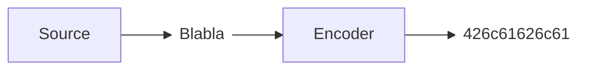

#aicc 

Source coding is seen as a way to compress the source, or a way to efficiently describe the source output.

The source is specified by its alphabet, and by the source statistic (?)

The **encoder** is specified by:
- The input alphabet ($\mathcal A$)
- the output alphabet ($\mathcal D$)
- the codebook ($\mathcal C$) which consists of finite sequences over the output alphabet
- the one-to-one encoding map $\Gamma$ from $\mathcal A^k \to \mathcal C$

>[!Example]
>$$
>\begin{array}{l|llll}
>A & \Gamma_{O} & \Gamma_{A} & \Gamma_{B} & \Gamma_{C} \\
>\hline a & 00 & 0 & 0 & 0 \\
>b & 01 & 01 & 10 & 01\\
>c & 10 & 10 & 110 & 011 \\
>d & 11 & 11 & 1110 & 0111
>\end{array}
>$$
>$\text{dac} \to \boxed{\Gamma_{O}} \to 11\ 00\ 10$
>$\text{dac} \to \boxed{\Gamma_{A}} \to 11\ 0\ 10$
>$\text{dac} \to \boxed{\Gamma_{B}} \to 1110\ 0\ 110$
>$\text{dac} \to \boxed{\Gamma_{C}} \to 11\ 0\ 011$

But we want to avoid the issue where some decoding can be ambiguous

>[!definition]
>We say that a code is uniquely decodable if every concatenation of codewords always has a unique parsing into a sequence of codewords (unique function)

>[!Example]
>The code $A$ is not uniquely decodable
>$bc \to 01\ 10$
>$ada \to 0\ 11\ 0$

>[!Example]
>Code $O$ is always uniquely decodable, because it is of fixed length.
>>[!Theorem]
>>A fixed-length code is always uniquely decodable

>[!Definition]
>A code is prefix-free if no codeword is a prefix of another codeword

>[!Theorem]
>- A prefix-free code is always uniquely decodable
>- A uniquely decodable code is not necessarily prefix-free

>[!Definition]
>A prefix free code is also called instantaneous code

>[!Theorem] Theorem, Kraft-McMillan's inequality
>If a D-ary code is uniquely decodable then its codeword lengths $l_1, \dots, l_M$ satisfies
>$$D^{-l_{1}}+\dots+D^{-l_{M}} \le 1$$
>>So if Kraft's inequality is not fulfilled, there doesn't exist a uniquely decodable code with this length (Contrapositive)
>
>>[!Theorem]
>>If the positive integers $l_{1},\dots, l_{M}$ satisfy Kraft's inequality for some integer $D$, then there exists a $D$-ary prefix-free code (hence decodable)

This implies that any uniquely decodable code can be substituted by a prefix free code of the same codeword lengths

>[!Check] We will focus on prefix-free codes
>- No loss of optimality
>- A prefix-free codeword is recognized as soon as its last digit is seen
>  $\implies$ less delay

>[!Definition]
>The average codeword-length is given by
>$$L (S, \Gamma) = \sum_{s \in A} p_{S}(s)l(\Gamma(s))$$

>[!theorem]
>Let $\Gamma : \mathcal A \to \mathcal C$ be the encoding map of a base $D$ code for the random variable $S\in \mathcal A$
>If the code is uniquely decodable, then the average codeword-length is lower bounded by the entropy of $S$
>$$
>H_D (S) \le L(S, \Gamma)
>$$

>[!Theorem]
>For every random variable $S\in\mathcal A$, and for every integer $D \ge 2$, there exists a prefix-free $D$-ary code for $S$ such that
>$$
>l(\Gamma(s)) = \lceil -\log_{D}p_{S(s)} \rceil, \quad \forall s \in A
>$$
>We call those codes $D$-ary Shannon Fano codes

But these codes seem complicated for nothing ! 
Well no, they are actually rather good :
>[!Theorem]
>The average codeword-length of a $D$-ary Shannon-Fano code for the random variable $S$ fulfills
>$$
>H_{D}(S) \le L(S,\Gamma_{SF})\lt H_{D}(S)+1
>$$

Sadly they are not optimal, some some examples can be drawn that have a smaller average length
>[!Example]-
>Let's say we have a letter that has an absurdly small probability. It's length will be very big, and could probably truncated, because it has a lot of empty nodes

## Optimal solution : Huffman code

We start by having all the leaves of the tree with their given weights. We order them by their weights. We join the leaves that have the lowest weights together. We keep going until everything 

>[!Lemma]
>The average path length of a tree with probabilities is the sum of the probabilities of the intermediate nodes
>$$
>\sum_{i}p_{i}l_{i} = \sum_{j}q_{j}
>$$

>[!Theorem]
>It is guaranteed for a Huffman code $\Gamma_{H}$ to be more optimized than another code ;
>$$L(S, \Gamma_{H}) \le L(S, \Gamma)$$
