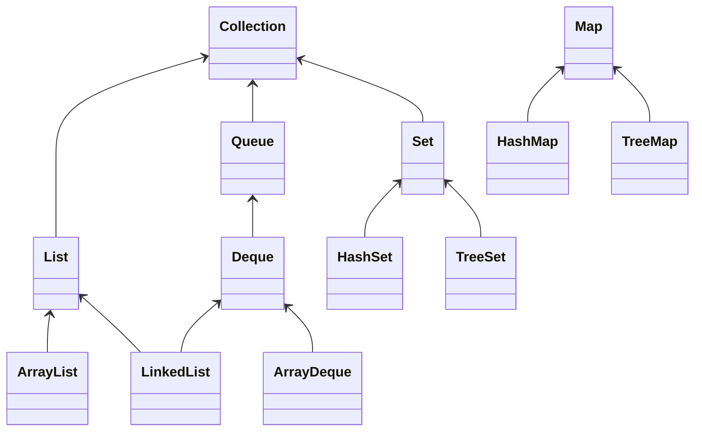

---
tags:
  - poop
---
La bibliothèque standard Java (ou **API Java**) implémente certaines collections :
(**J**ava **C**ollections **F**ramework)
# Organisation

Pour chaque type de collection, on a 
- Une interface
	- Méthodes/Opérations du type de collection
- Classes 
	- Implémentations spécifiques de l'interface



*Hiérarchie (simplifiée) des collections*

# Interface Collection

On y trouve des méthodes de consultation
- `boolean isEmpty`
- `int size()`
- `boolean contains(Object e)`
- `boolean containsAll(Collection<E> c)`
Des méthodes d'ajout
- `boolean add(E e)`
- `boolean addAll(Collection<E> c)`
Méthodes de suppression
- `void clear()`
- `boolean remove(Object e)`
- `boolean removeAll(Collection<E> c)`
- `boolean removeIf(Predicate<E> p)`
- `boolean retainAll(Collection<E> c)`
# Lambdas

L'interface `Predicate` nous permet de tester via une fonction lambda si l'élément suit une condition
```Java
c.removeIf((i) -> { return i == 0; });
```

## Méthodes Optionnelles

Toutes les méthodes de modification sont en réalité optionnelles :
-> Les listes immuables ne peuvent pas être modifiées

Méthodes ne sont pas appelées si la collection est immuable.

[[05.4 Listes]]