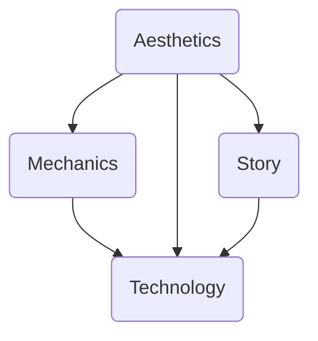

#gde

| Is          | Is not          |
| ----------- | --------------- |
| Mécaniques  | Artistic design |
| Equilibrage | Esthetique      |
| Testing     | Couleurs        |
# A bit of history

Au départ, les jeux vidéos sont modelisés sur les jeux de plateaux
Au départ aussi, peu de personnes travaillent sur le jeu
Les codeurs se chargent de tous les aspects

# Comment trouver les idées

- Observer (ce qui marche ou pas)
- Brainstormer (trouver pleins d'idées)
- Cadavre exquis
	- Mish mash random words together and that's ur game !!!

- Voler un maximum d'idées !!!!!!!

# Cahier des charges

N'est pas forcément figé, peut être update

Un document formel qui décrit le jeu (en tout cas les points essentiels)

Un elevator pitch (3 phrases/90 secondes qui décrivent le jeu)

Lore...
## Mais pq ?

- Se coordonner
- Structurer son jeu (keep consistency)
# Tester

Facile de se perdre :
- niveau de difficulté
- attentes des joueurs
- bugs (mais c'est pas une session de debug)
## Étapes

1. Protocole
	- Décrire un protocole de test pour déterminer les aspects à tester
2. Recrutement
	- Chercher des gens
3. Session
	- Laisser les gens jouer (et casser des trucs)
4. Observer
	- Regarder les gens jouer (sans parler <- important !!!) -> recueillir des infos sur le jeu
5. Discuter
	- Échanger avec les gens qui ont fait les tests -> voir leur feedback
6. Implémenter
	- Ajouter (ou non) les idées des testeurs
	- Moduler le jeu selon les observations
### Protocole

Déterminer : 
- quoi tester
- le public cible
### Mais qui ?

- Des amis
	- Avis qui rassurent
- Des experts
	- Avis qui tranchent
- Des inconnus
	- Avis divers

### Session

>[!Important] Tout interaction humaine est une influence -> interdit !!!!
> Toujours donner le minimum d'info sur les jeu

>[!Warning] ça peut être frustrant -> le joueur va tout casser et faire l'opposé de ce qu'il doit

Il faut prendre des notes
- Sur les actions du joueur
- Sur les réactions du joueur

>[!Warning] Il faut savoir prendre du recul
>Recevoir des critiques peut/va faire mal -> comprendre d'où vient la critique et comment fix

Il faut savoir ignorer certaines remarques des playtesters.

Le playtesting c'est régulier et même à travers TOUT le dev
# Prototyper

C'est un petit modèle qui permet de test des idées
Prototyper -> améliorer le jeu !

C'est tout aussi régulier que le playtesting

>[!Quote] C'est la vie

On peut faire des prototypes virtuels (dans la tête), papier (in real life) ou digital (dans le jeu/faux jeu (style powerpoint))

# Avant le Game Design

- Quel type d'expérience de jeu (éléments:)
	- Objectifs précis 
	- Règles intéressantes
	- Des retours réguliers
	- Du challenge
	- Motivation
		- ==FLOW==
		- Pour garde le joueur, il faut rester dans le "Flow Channel" -> pas trop dur, ni trop facile
- Que fera le joueur (problèmes à résoudre)

Etablir conditions victoire/défaite -> le joueur doit être au courant

# Puzzle

Plus visible

Moins visible

## Technologie 

Notamment le choix de game engine

## Mécaniques

Règles très objectives et clairement déclarées
Très divers

### Règles

- Ce que le joueur peut faire pour gagner/ éviter de perdre
- Mènent aux dynamiques du jeu
- Moyen de limiter les actions des joueurs 
- Forcer les joueurs à jouer + optimal
## Dynamiques

- Développées par les joueurs -> ce que les mécaniques débloquent

### 10 actions fondamentales

1. Eviter
2. Détruire
3. Sélectionner
4. Associer
5. Tirer
6. Bouger
7. Créer 
8. Ecrire
9. Gérer (ex : inventaire)
10. Actions aléatoires (ex : roguelike)

# Analyse de jeux

Pour faire des bons jeux -> jouer à des bons jeux (pour s'en inspirer)

Analyser -> prendre des notes
- Pas juste être passif !

# En quoi ça consiste

- Créer des niveaux
- Création de l'interface (ou HUD)
- Conception Audio
- Conception du monde (histoire)
- Conception du système (mécaniques)
- Conception du contenu (personnage, énigmes, quêtes)
- Rédaction (dialogues, descriptions)
# PICO-8

- Pixel art 8x
- Résolution 128x
- 32kb de mémoire
- Peu de son (4 channels)
- Contrôles simples

